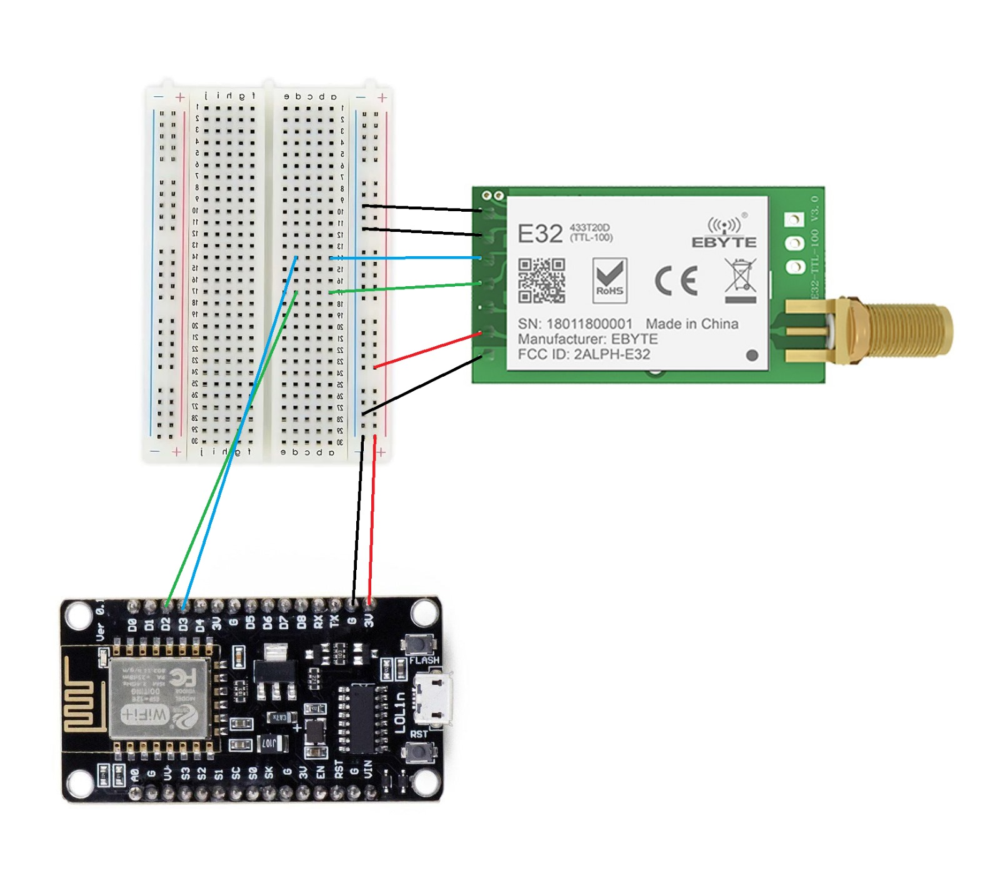

# Real-Time Ring Bus Tracking Application for IZTECH Campus

## Overview
The Real-Time Ring Bus Tracking Application is designed to improve the commuting experience within the IZTECH campus by providing live tracking of ring buses. This application allows students and staff to see real-time locations of buses, estimated arrival times at stops, and optimize their commuting plans accordingly.

## Features
- **Live Bus Tracking:** View the current location of any campus ring bus in real-time on a map.
- **Estimated Arrival Times:** Get the estimated time of arrival (ETA) at each bus stop.
- **Route Visualization:** See the entire route of any selected bus with all stops marked.

## Technologies
- **Backend:** Spring Boot
- **Frontend:** React Native for cross-platform mobile application development
- **Database:** MySQL
- **Data Communication Module:** E32 433T20d LoRa for long-range communication (5 KM Range)
- **GPS Module:** GY-NEO6MV2 for obtaining real-time location data
- **IoT** ESP8266 Wifi Module
- **MicroProcessor** Arduino Nano 

## System Design
  
The system architecture is structured to flow data from the bus all the way to the end-users through the mobile application. 

 

#### Data Flow
- **Bus Device** collects current coordinates via its GPS module from the satellites and transmits coordinates to the gateway IoT Device via its LoRa Module.
- **Gateway IoT Device** receives this data via LoRa Module and forwards it to the Backend Server via Wifi module. These devices stationed in places where wifi is accessible.
- **Web Server** processes the incoming data (ETA Calculations, Filtering Corrupt Data, Stop-Location Designation etc.), storing it in the Database, and also retrieves data as requested by the Mobile App.
- **Mobile App** fetches and displays this data to the end users, allowing them to track buses in real-time.

#### Why Using LoRa and Not GSM Modules?

The primary reason for not using GSM module technology was the recurring service fees associated with data transmission. On the other hand, LoRa technology and WiFi modules allow for data transmission at virtually zero cost. This decision led to a more complex system. However, the trade-off was worthwhile, it makes the project more marketable to potential stakeholders. Also more fun project to work on. :slightly_smiling_face:

## Components 

#### Bus Device
 

- **Arduino Nano:** Serves as the microcontroller, manages the GPS data to the E32 LoRa Module.
- **E32 LoRa Module:** Responsible for transmitting the GPS data to the IoT Gateway Device.
- **GPS Module:** Captures current GPS coordinates directly from satellites.

All connections are soldered onto a PCB on Bus Device to prevent wire detachment due to vibrations on the shuttle bus.
    
#### IoT Gateway Device
 

- **ESP8266 Module:** Functions as both a microcontroller and a WiFi module. It receives the transmitted data from the E32 LoRa Module and forwarding it via WiFi to the backend server.
- **E32 LoRa Module:** Receives the GPS data transmitted from the Bus Device and routes it to the ESP8266 module via jumper wires.

IoT Gateway Devices (Receivers) are stationed on buildings near windows that have WiFi.

***Casing*** of these devices were designed in SolidWorks by a mechanical engineer friend at our university (Head to Acknowledgments for his profile). The designs are available under [3D Printer Model Designs](./assets/3D_Model_Designs) directory. These casings are printed at the [IZTECH FabLab](https://fablab.iyte.edu.tr/en/home-page/) using a 3D printer.

## Coverage Area

We tested various locations across the campus to determine the best coverage areas for the receiver, Here is the map of our testing locations:

 

It became apparent that a single IoT Gateway Device (Receiver) would not be sufficient to cover the entire campus for bus device communication.

 

Therefore, an additional IoT Gateway Device is being assembled and will be placed in two separate locations to get full campus coverage.

## Backend Infastructure

Spring Boot for our backend infrastructure due to its robustness and widespread industry adoption, which provides a solid foundation for building and deploying scalable applications.

## Mobile App 

Mobile app screenshot, route screen and its ETA for each stop.

 

## Contributors

- [Erman Avsar (@kontela)](https://github.com/kontela) - Responsible for system design and implementing the entire backend infrastructure. 
- [Yasir Duman [@lineyha]](https://github.com/lineyha) - Developed the IoT/Embedded devices (Arduino Nano, ESP8266, GPS Module, LoRa Module) Firmware and its integration to all module connections.
- [Betul Soylek [@Betulsoylekk]](https://github.com/Betulsoylekk) - Created the mobile app and its design.

## Acknowledgments
[Ufuk Kagan Bayram](https://www.linkedin.com/in/ufuk-kağan-bayram-923287256/) for his contribution to the team and field testing. 
[Mertcan Turan](https://www.linkedin.com/in/mertcan-turan-933b19268/) for his expertise in designing the device casings using SolidWorks 3D design.
